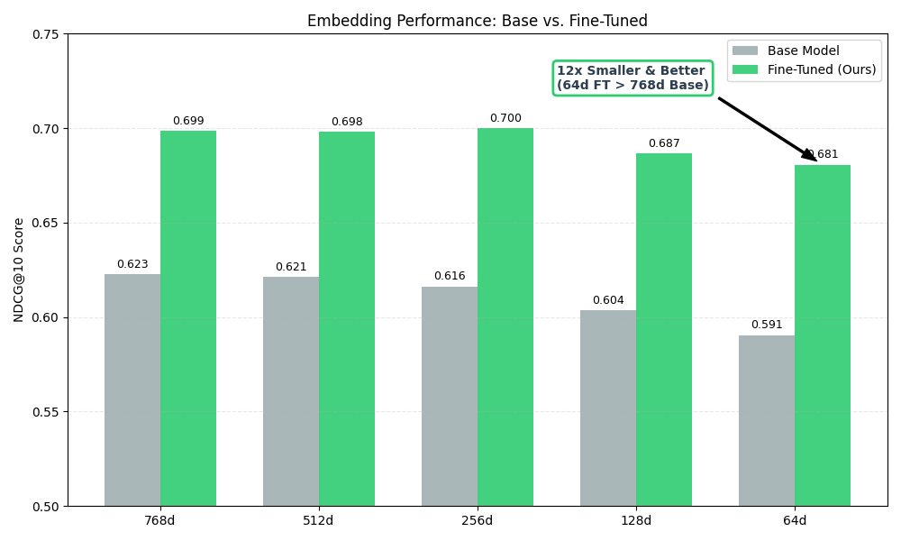
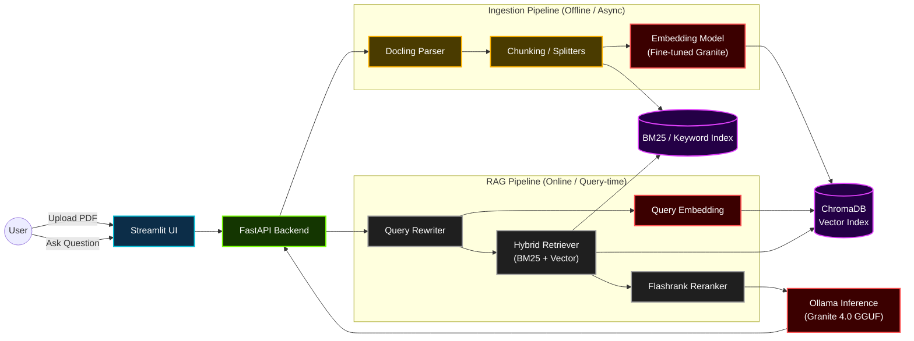

# AI Study Partner with Hybrid RAG & Fine-Tuned Embedding Models
A **local academic assistant** implemented with **FastAPI, LangChain, and Docker**, designed to help students **master lecture notes and course materials**.

The system utilizes a Hybrid Retrieval (RAG II) architecture combining BM25 keyword search and Vector similarity with Flashrank Reranking to ensure high-precision answers for complex academic queries.

---

## Project Features

1. **Hybrid RAG** – Combines **BM25** (Keyword) and **Vector Search** (Semantic) with **Reranking** to improve answer.
2. **Fine-Tuned Embedding** – Uses a **custom embedding model** fine-tuned with **Unsloth & LoRA** for better retrieval.
3. **Advanced Data Ingestion** – Preserves document structure using **Docling** and export as **Markdown format**.
4. **Context-Aware Chat** – Implements **Query Transformation** to handle multi-turn follow-up questions effectively.
5. **Privacy-First & Offline** – Fully containerized architecture using **Docker** (no user data leaves the local network).
   
---

## Project Structure
```
academic-buddy/
├── docker-compose.yml                  # Orchestrates Backend, Frontend, Chroma, Ollama
├── init_model.sh                       # Application build script
├── .gitignore
├── README.md
│
├── fine_tune/                          # FINE TUNE SCRIPT FOR REASONING AND EMBEDDING MODEL
|   ├── reasoning/
|   |   └── granite4.ipynb              # Might be used in future improvement
|   |
│   └── embedding/
│       └── granite4_embedding.ipynb    # Pushed to HuggingFace Hub 
│
├── backend/                            # THE CORE AI ENGINE
│   ├── Dockerfile
│   ├── requirements.txt
│   │
│   ├── config/                         # Configuration
│   │   ├── __init__.py
│   │   ├── settings.py                 # Env vars
│   │   ├── prompts.yaml                # Prompt vars
|   |   └── schemas.py
│   │
│   └── src/
│       ├── __init__.py
│       ├── main.py                     # FastAPI Entry Point
|       ├── utils.py                    # Convert prompts.yaml into usable variables
│       │
│       ├── api/                        # API Routes (The "Controller" layer)
│       │   ├── __init__.py
│       │   ├── chat.py                 # Pipeline for chatbot workflow
│       │   └── documents.py            # Pipeline for data ingestion
│       │
│       ├── chatbot/                    # LLM & RAG Logic
│       │   ├── __init__.py
│       │   ├── client.py               # Ollama setup
│       │   ├── chains.py               # LangChain pipelines
│       │   └── retriever.py            # Search & Reranking logic
│       │
│       └── ingestion/                  # File Processing
│           ├── __init__.py
│           ├── loader.py               # Docling logic
│           ├── splitter.py             # Text splitting logic
│           └── vector_db.py            # ChromaDB interactions
│
└── frontend/                           # THE USER INTERFACE
    ├── Dockerfile
    ├── requirements.txt
    └── src/
        ├── app.py                      # Main UI Entry point
        ├── api_client.py               # Wrapper for calling Backend API
        └── components/                 # Reusable UI widgets (Chat bubbles, Sidebar)
            ├── chat_interface.py
            └── file_manager.py
```

---

## LLM Used

| Models                                         | Functions              | Source     |
|------------------------------------------------|:----------------------:|:----------:|
| granite-4.0-micro (base)                       | Reasoning              |[Hugging Face](https://huggingface.co/ibm-granite/granite-4.0-micro)|
| granite-embedding-english-r2 (Fine-Tuned)      | Embedding              |[Hugging Face](https://huggingface.co/shatonix/granite-embedding-math-cs)|

- **Prompt Engineering**: Follow the guideline from [Granite Language Cookbook](https://www.ibm.com/granite/docs/use-cases/prompt-engineering)

---

## Embedding Model Engineering

### 1. Synthetic Data Strategy
To create a high-quality training dataset, I engineered a synthetic corpus combining:
* **Mathematical Reasoning:** [nvidia/OpenMathInstruct-1](https://huggingface.co/datasets/nvidia/OpenMathInstruct-1)
* **Code Logic:** [glaiveai/glaive-code-assistant-v3](https://huggingface.co/datasets/glaiveai/glaive-code-assistant-v3)
* **Domain Knowledge:** Curated Computer Science textbook structures.

### 2. Metric Selection
I optimized for **NDCG@10** rather than simple accuracy because LLMs heavily prioritize information at the start of the context window.
* **The Goal:** Ensure the most relevant citations appear at **Rank #1–3** rather than being buried at Rank #10.
* **The Impact:** By prioritizing early-rank relevance, the retrieval layer is structured to **minimize hallucination**.

### 3. Fine-Tuning Performance
Trained using **Matryoshka Representation Learning (MRL)**, the model achieves a massive efficiency breakthrough.

Key Result:
* The fine-tuned model at **64 dimensions** outperforms the base model at full **768 dimensions**.
* Allow a **12x reduction in vector storage and search latency** while actually **improving retrieval quality**.

<p align="center">
  <br/>
  <i>Embedding Benchmark.</i>
</p>

---

## System Architecture

### Infrastructure & UI
* **Docker Compose** – Container orchestration ensuring a reproducible, fully offline-capable environment for all services.
* **Streamlit** – Interactive frontend UI for file uploads, chat interface, and rendering source citations.
* **FastAPI** – High-performance async backend API handling request routing and session management.

### AI Engine & Logic
* **LangChain** – Application logic framework managing RAG chains, chat history, and prompt engineering.
* **Ollama** – Local inference server hosting the quantized **Granite 4.0** model for secure, offline reasoning.
* **Granite Models** – Fine-tuned models utilized for both **Reasoning** (answering questions) and **Embedding** (vectorizing data).

### Retrieval & Storage (RAG)
* **Docling** – Advanced document parsing engine that preserves PDF structure (headers, tables) during ingestion.
* **ChromaDB** – Local vector database for storing and querying semantic embeddings of course materials.
* **Hybrid Retriever** – Combines **BM25** (keyword match) and **Vector Search** (semantic match) to maximize retrieval coverage.
* **Flashrank** – Cross-encoder reranking model that re-scores retrieved documents to ensure high-precision context is sent to the LLM.


